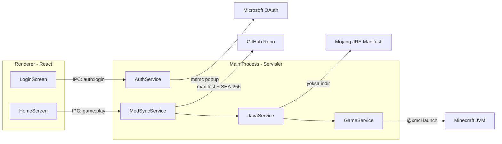

# MCTG Minecraft Launcher — Teknoloji ve Mimari Planı

## Önerilen Teknoloji Yığını: Electron + React + TypeScript

Üç aday arasında (C# WPF, Electron, Tauri) önerim **Electron**. Gerekçeler:

- **3D skin renderlama (belirleyici kriter):** `skinview3d` (three.js tabanlı) Minecraft skinleri için endüstri standardı; döndürme, zoom, yürüme/idle animasyonları kutudan çıkıyor. WPF tarafında eşdeğeri yok (Viewport3D ile elle yazmak gerekir), Tauri'de ise UI aynı olsa da backend ekosistemi eksik.
- **Microsoft OAuth:** `msmc` kütüphanesi Electron pencereleriyle yerleşik entegre ve Mojang onaylı hazır client ID ile geliyor — kendi Azure kaydı + Mojang onay formu beklemeden bugün çalışır.
- **Launcher çekirdeği:** Eski `minecraft-launcher-core` 2024'ten beri güncellenmiyor; onun yerine aktif bakımda olan `@xmcl/`* ailesi (X Minecraft Launcher'ın çekirdeği, son push Nisan 2026) kullanılacak. `@xmcl/installer` Mojang'ın resmi JRE manifestinden **otomatik Java kurulumunu** da destekliyor — 2. maddedeki Java otomasyonunu doğrudan çözüyor.
- **Animasyon/tasarım:** Tailwind CSS v4 + Framer Motion ile istenen yumuşak geçişler ve minimalist dil.
- **Dürüst trade-off:** Electron ~150-250 MB RAM kullanır; launcher senaryosunda kabul edilebilir (oyun başlayınca pencere gizlenecek).

Çekirdek paketler:

- Çatı: `electron`, `electron-vite`, `electron-builder` (NSIS paketleme)
- UI: `react`, `typescript`, `tailwindcss`, `framer-motion`, `zustand`
- 3D: `skinview3d`
- Auth: `msmc` (Electron popup ile OAuth, refresh token desteği)
- Oyun: `@xmcl/core` (başlatma), `@xmcl/installer` (sürüm/asset/kütüphane + Java runtime indirme)
- Depolama: `electron-store` (+ `safeStorage` ile şifreli oturum)

## Klasör Mimarisi

```
mctg/
├── package.json, electron.vite.config.ts, electron-builder.yml, tsconfig*.json
├── resources/                      # uygulama ikonu vb.
└── src/
    ├── main/                       # Electron ana süreç (Node)
    │   ├── index.ts                # çerçevesiz pencere, yaşam döngüsü
    │   ├── ipc.ts                  # tüm IPC kanal kayıtları
    │   └── services/
    │       ├── AuthService.ts      # msmc: login / refresh / logout, skin indirme
    │       ├── SettingsService.ts  # electron-store: RAM, seçili profil
    │       ├── JavaService.ts      # Java tespiti + otomatik JRE kurulumu
    │       ├── GameService.ts      # @xmcl: sürüm indirme + oyunu başlatma
    │       └── ModSyncService.ts   # GitHub manifest + SHA-256 anti-cheat
    ├── preload/index.ts            # contextBridge: window.launcher köprüsü
    └── renderer/src/
        ├── App.tsx                 # ekran geçiş animasyonları (AnimatePresence)
        ├── screens/                # LoginScreen, HomeScreen
        ├── components/             # TitleBar, SkinViewer3D, PlayButton,
        │                           # ProfileSelector, SettingsPanel
        └── stores/                 # useAuthStore, useSettingsStore (zustand)
```

Çalışma verileri `%APPDATA%/mctg` altında: `game/` (paylaşılan assets/libraries/versions), `instances/<profilId>/mods/`, `runtime/<javaSurumu>/`.

## Akışlar




Oyna akışı: mod doğrulama → Java doğrulama/kurulum → oyun başlatma; her aşama ilerleme çubuğu olarak UI'a yansır.

## GitHub Mod Reposu Şeması (senin belirteceğin repo)

- `profiles.json`: profil listesi — `{ id, name, description, mcVersion, loader: { type, version } }`
- `profiles/<id>/manifest.json`: dosya listesi — `{ files: [{ path, sha256, size, url }] }`
- `profiles/<id>/mods/*.jar`: mod dosyaları
- Repoya, mod güncellerken manifesti otomatik üreten küçük bir Node script'i de ekleyeceğim.

Anti-cheat: Oyna'ya her basışta yerel `mods/` klasörü SHA-256 ile manifeste karşı doğrulanır; fazla/değiştirilmiş dosyalar silinir, eksikler indirilir. Profil mod klasörü tamamen launcher yönetimindedir (elle eklenen dosyalar silinir — istenen davranış bu).

## Yol Haritası (her adımda onayın alınacak)

- **Adım 1 — Microsoft Login + UI iskeleti** (bu plan onaylanınca kodlanacak, kapsam aşağıda)
- **Adım 2 — Ayarlar:** RAM slider (2-16 GB, varsayılan 4), electron-store kalıcılığı, animasyonlu ayarlar paneli
- **Adım 3 — Java otomasyonu + vanilla başlatma:** yerel Java tespiti, yoksa arka planda JRE indirme (ilerleme göstergeli), Oyna butonunun gerçek işlevi
- **Adım 4 — Profil sistemi + GitHub mod senkronizasyonu / anti-cheat:** profil seçici, hash doğrulama, otomatik onarım
- **Adım 5 — Cila + paketleme:** geçiş animasyonları rötuşu, hata bildirimleri, electron-builder ile kurulum paketi

## Adım 1 Kapsamı: Microsoft Login ve UI İskeleti

- electron-vite iskeleti; çerçevesiz (frameless), koyu temalı pencere
- Özel TitleBar: sağ üstte Ayarlar / Alta Al / Kapat butonları
- LoginScreen: animasyonlu karşılama, tek seçenek "Microsoft Hesabı ile Giriş" → msmc Electron popup ile gerçek OAuth; yükleme ve hata durumları
- Oturum kalıcılığı: refresh token `safeStorage` ile şifrelenip saklanır, uygulama açılışında otomatik giriş
- HomeScreen iskeleti: solda `skinview3d` ile giriş yapan hesabın gerçek skini (fareyle döndürülebilir, idle animasyonlu); ortada şık "OYNA" butonu (şimdilik pasif); altında hafif tasarımlı profil seçici placeholder'ı ("Default"); ayarlar butonu boş panel açar
- Skin dokusu CORS engeline takılmaması için main process'te indirilip renderer'a data URL olarak verilir
- Ekranlar arası yumuşak geçiş (AnimatePresence fade/slide)

Kabul kriterleri: uygulama açılır, gerçek Microsoft girişi çalışır, 3D skin görünür ve döndürülebilir, titlebar butonları işlevsel, oturum yeniden açılışta korunur.

## Notlar ve Riskler

- Gerçek OAuth testi senin Microsoft/Minecraft hesabınla yapılacak (benim tarafımda hesap yok); giriş penceresi açıldığında sen doğrulayacaksın.
- İleride istersek kendi Azure client ID'mize geçebiliriz (Mojang onay formu gerektirir); v1'de msmc'nin onaylı varsayılanı kullanılacak.
- GitHub repo adresi ve mod loader tercihi (Fabric/Forge/NeoForge) Adım 3-4 öncesinde senden alınacak; şimdilik ayarlarda yapılandırılabilir alan olarak tasarlanacak.

